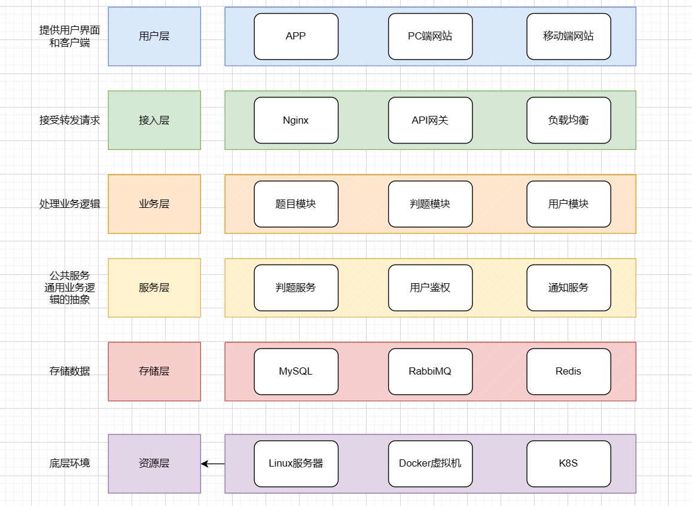
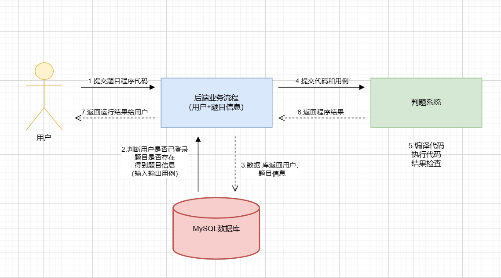
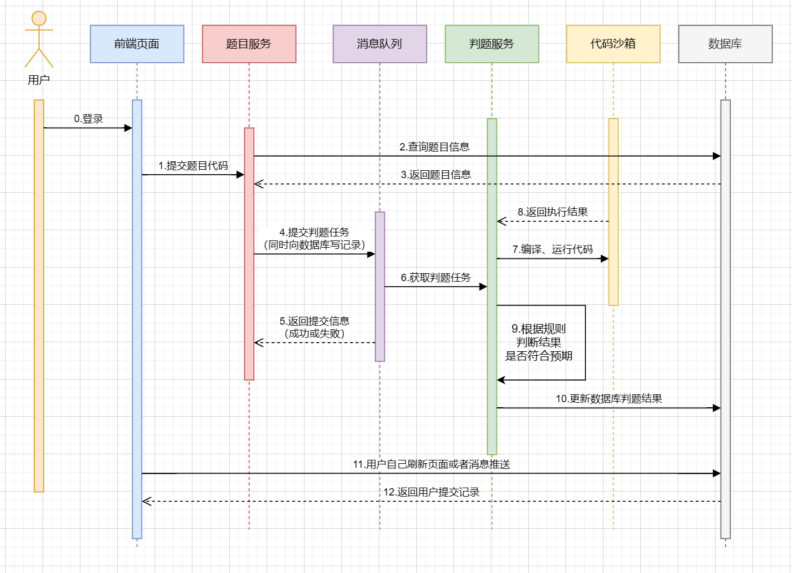
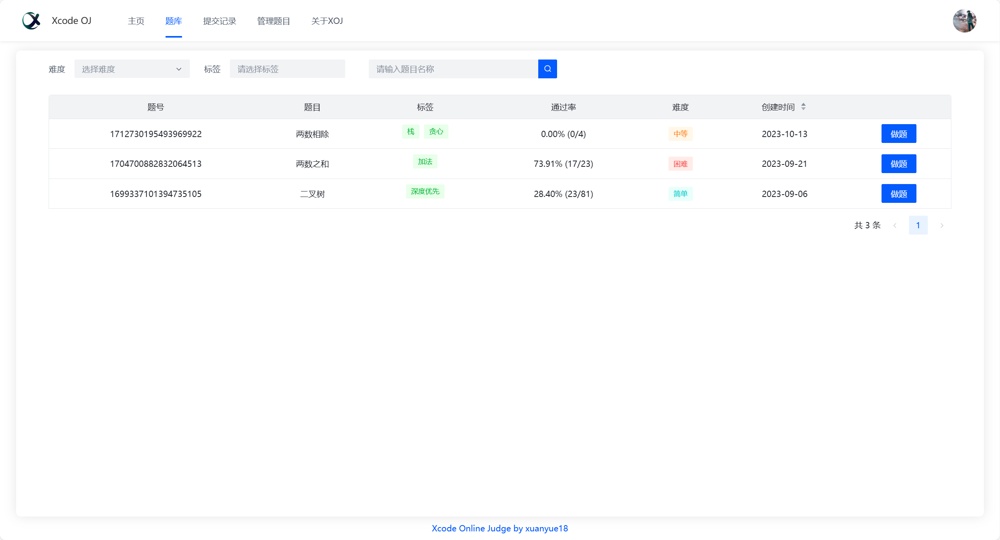
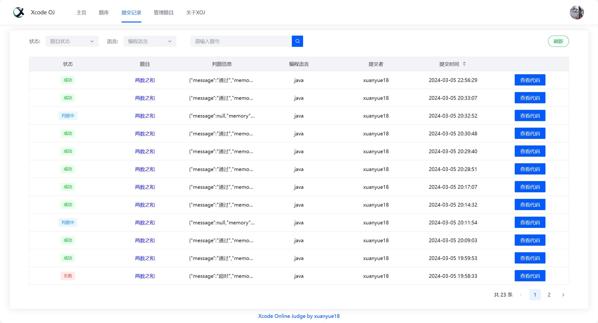
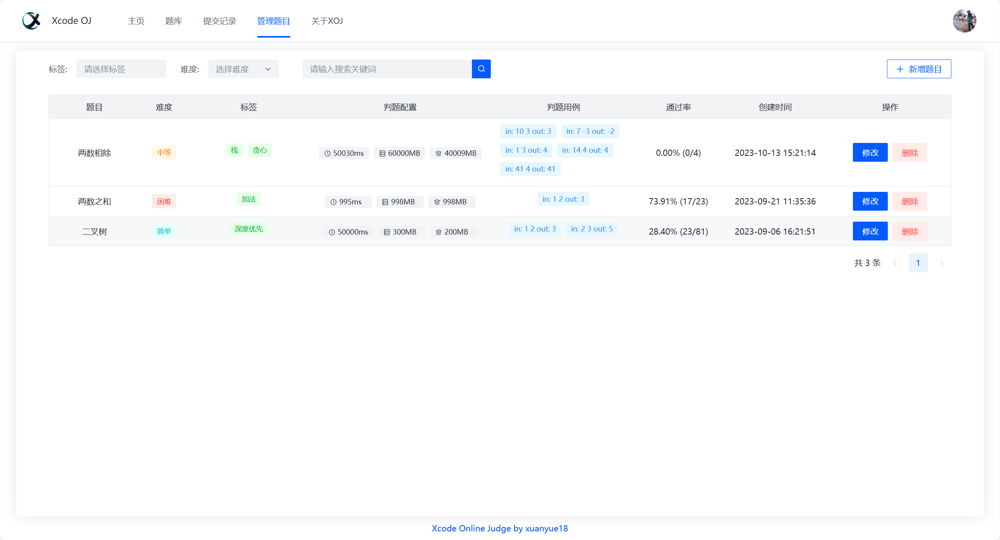
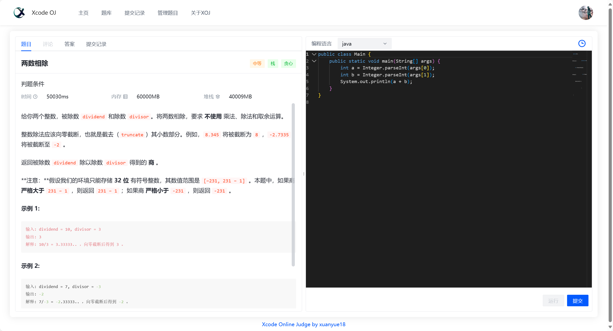

# Xcode OJ - 在线判题系统

## 项目介绍

OJ，即在线判题评测系统，允许用户选择题目进行在线解答。用户可以编写代码并提交至系统，系统将根据出题人设置的答案判断提交的代码结果是否正确。
> 演示地址: [https://oj.xuanyue18.cn/](https://oj.xuanyue18.cn/) (用户名：`test`，密码：`12345678`)

## 实现核心

### 1. 权限校验
- 管理用户提交代码的权限，明确谁可以提交代码，谁不可以。

### 2. 代码沙箱（安全沙箱）
- **用户代码隔离**：确保用户编写的恶意代码（如木马文件、修改系统权限）不会影响到沙箱之外的系统。
- **资源分配**：限制用户程序的资源占用，防止用户程序占满所有内存，影响其他用户使用。

### 3. 判题规则
- 通过题目用例比对和结果验证，确保判题的准确性。

### 4. 任务调度
- 在服务器资源有限的情况下，通过排队和顺序执行判题任务，优化资源分配。

## 技术选型

### 前端
- Vue3
- Acro Design 组件库
- 在线编辑器
- 在线文档浏览

### 后端
- Java 进程控制、安全管理器、JVM
- 虚拟器（云服务器）
- Docker（代码沙箱实现）
- SpringCloud 微服务
- 消息队列 RabbitMQ
- SpringBoot
- MySQL

## 项目功能

### 已有功能

#### 题目模块
- 创建、删除、修改题目（管理员）
- 搜索题目、在线做题、提交题目代码（用户）

#### 用户模块
- 注册、登录
- 用户管理（管理员）

#### 判题模块
- 提交判题、错误处理（内存溢出、安全性、超时）
- 自主实现代码沙箱（安全沙箱）
- 开放接口（提供独立的新服务）

### 待扩展功能
- 支持多种编程语言
- Remote Judge
- 完善的评测功能（普通测评、特殊测评等）
- 统计分析用户判题记录
- 权限校验

## 架构设计

## 业务流程

## 项目演示

